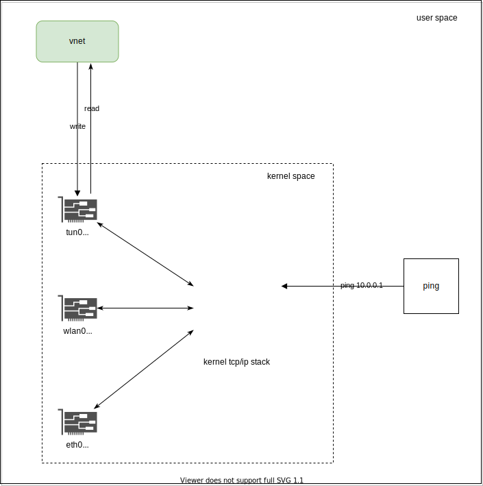
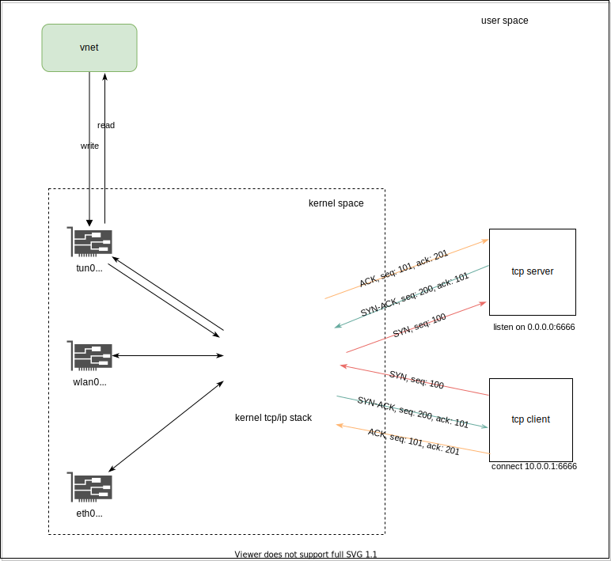

# vnet

This is the repo for my network lab.

## Get started

```
./build.sh
```

and then run execution in Linux

```
sudo ./vnet
```

A `tun` interface is up and it is ready for packets reading and writing.

### view `ping` packet

```
ping -I 10.0.0.2 -s 0 -c1 10.0.0.1
```


### view TCP segments and 3-way handshake

```
./tcp_server
```

```
echo -n "test out the server" | nc 10.0.0.1 6666
```
